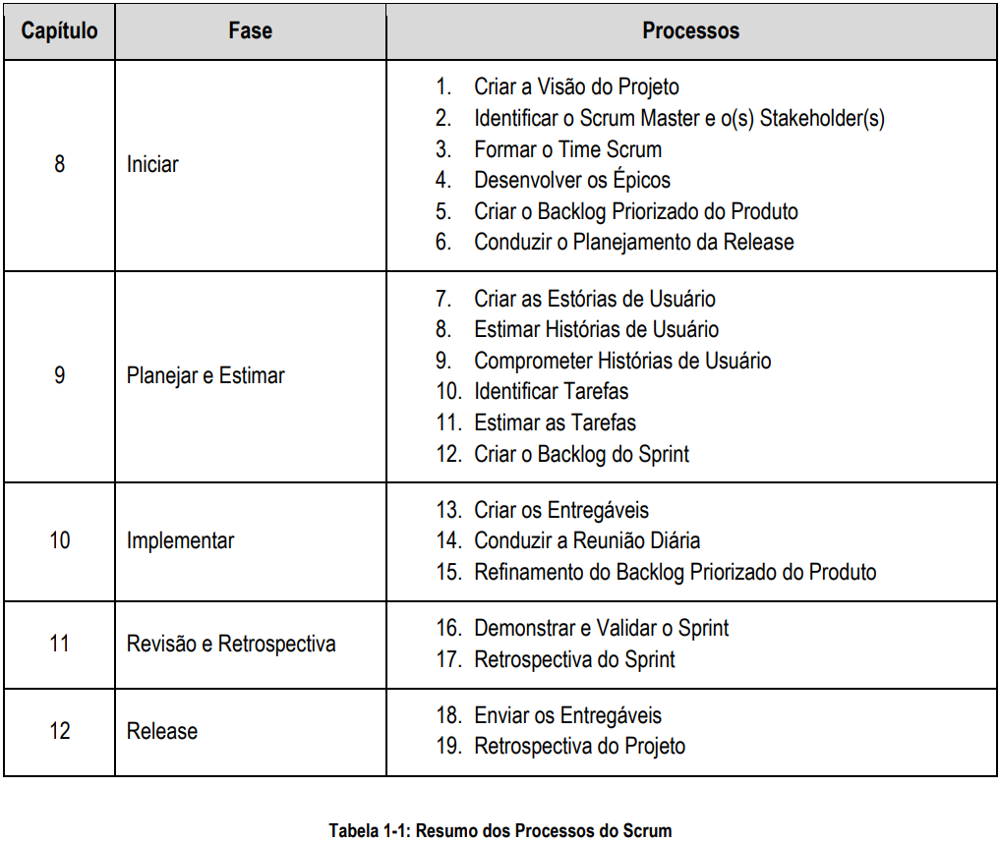

# 1. Introdução

[GUIA](https://www.scrumstudy.com/portuguese/scrum-fundamentals-certified)

Scrum, tal como definido no Guia SBOK™ é aplicável para:

- Portfólio, programas e/ou projetos em qualquer indústria
- Produtos, serviços ou qualquer outros resultados que serão fornecidos aos stakeholders
- Projetos de qualquer tamanho ou complexidade

## 1.1 Visão geral do Scrum

<h2 align="center">
    
</h2>

### 1.1.1 Breve História do Scrum

Em meados dos anos 80, Hirotaka Takeuchi e Nonaka Ikujiro definiram uma estratégia flexível e completa
para o desenvolvimento de produtos, onde o time de desenvolvimento trabalha como uma unidade, para
alcançar um objetivo comum. Eles descreveram uma abordagem inovadora para o desenvolvimento de
produtos, que chamaram de abordagem holística ou "rugby", "onde um time tenta percorrer a distância
como uma unidade, passando a bola para frente e para trás."

## 1.2 Por que usar o Scrum?

Algumas das principais vantagens da utilização do Scrum, em qualquer projeto, são:

1. **Adaptabilidade** — O Controle de Processos Empíricos e a Entrega Iterativa fazem com que os
   projetos sejam adaptáveis e abertos à incorporação de mudanças.

2. **Transparência** — Todos as fontes de informações, tais como, o Scrumboard e o Gráfico Burndown
   do Sprint, são compartilhadas gerando um ambiente de trabalho aberto.

3. **Feedback Contínuo** — O Feedback Contínuo é fornecido através de processos denominados como
   Conduzir a Reunião Diária e Demonstrar e Validar o Sprint.

4. **Melhoria Contínua** — As entregas melhoram progressivamente, Sprint por Sprint, através do
   processo de Refinamento do Backlog Priorizado do Produto.

5. **Entrega Contínua de Valor** — Os processos iterativos permitem a entrega contínua de valor tão
   frequente quanto exigido pelo cliente, através do processo de Envio de Entregáveis.

6. **Ritmo Sustentável** — Os processos do Scrum são projetados de tal forma, que as pessoas
   envolvidas trabalham em um ritmo sustentável, podendo, em teoria, continuar indefinidamente.

7. **Entrega Antecipada de Alto Valor** — O processo de Criar o Backlog Priorizado do Produto garante
   que as exigências de maior valor ao cliente sejam atendidas primeiramente.

8. **Processo de Desenvolvimento Eficiente** — O Time-boxing e a minimização de trabalho não
   essencial conduzem a níveis mais altos de eficiência.

9. **Motivação** — Os processos de Conduzir a Reunião Diária e de Retrospectiva do Sprint conduzem a
   níveis mais altos de motivação entre os colaboradores.

10. **Solução de Problemas de Forma mais Rápida** — A colaboração e a colocation de times
    multifuncionais conduzem a resolução de problemas de maneira mais rápida.

11. **Entregas Eficazes** — O processo de Criar o Backlog Priorizado do Produto, e as revisões
    periódicas após a geração de entregáveis, garantem entregas eficazes para o cliente.

12. **Com Foco no Cliente** — Uma abordagem colaborativa com stakeholders e a ênfase no valor de
    negócio, garantem uma estrutura orientada para o cliente.

13. **Ambiente de Alta Confiança** — Os processos de Conduzir a Reunião Diária e de Retrospectiva do
    Sprint promovem a transparência e a colaboração, resultando em um ambiente de trabalho de alta
    confiança, e garantindo baixo atrito entre os colaboradores.

14. **Responsabilidade Coletiva** — O processo de Estimar e Comprometer as Histórias de Usuário
    permite que os membros do time se sintam responsáveis pelo projeto e por seu trabalho,
    resultando em uma qualidade melhor.

15. **Alta Velocidade** — Uma estrutura de colaboração que permite que os times multifuncionais
    altamente qualificados, atinjam o seu pleno potencial e alta velocidade.

16. **Ambiente Inovador** — Os processos de Retrospectiva do Sprint e de Retrospectiva do Projeto
    criam um ambiente de introspecção, aprendizagem e adaptabilidade, que levam a um ambiente de
    trabalho inovador e criativo.

### 1.2.1 Escalabilidade de Scrum

Para serem eficazes, o tamanho ideal dos Times Scrum deve ser de seis à dez membros. Esta prática pode
induzir à concepção errônea de que o Scrum pode ser utilizado apenas para projetos pequenos. Ao
contrário, o Scrum pode ser facilmente escalado para o uso eficaz em grandes projetos. Em situações em
que o tamanho do Time Scrum ultrapassa dez pessoas, vários Times Scrum podem ser formados para
trabalhar no projeto.

## 1.3 Objetivo do Guia SBOK™

Nos últimos anos, tornou-se evidente que as organizações que utilizam Scrum como modelo para a
implementação de projetos, obtêm consistentemente alto Retorno sobre Investimento. O foco do Scrum na
entrega orientada a valor ajuda os Times Scrum a entregarem resultados o mais rápido que for possível
durante todo o projeto

### 1.4 Estrutura do Guia SBOK™

O Guia SBOK™ é dividido em três seguintes áreas:

1. Princípios.
2. Aspectos.
3. Os processos .

<h2 align="center">
    
</h2>

### 1.4.2 Princípios do Scrum

Os Princípios do Scrum são as diretrizes fundamentais para a aplicação do framework Scrum e devem
obrigatoriamente serem usados em todos os projetos Scrum. Os seis princípios do Scrum apresentados no
segundo capítulo são:

1. Controle de Processos Empíricos
2. Auto-organização
3. Colaboração
4. Priorização Baseada em Valor
5. Time-boxing
6. Desenvolvomento Iterativo

<h2 align="center">
    
</h2>

1. **Controle de Processos Empíricos** — Esse princípio enfatiza a filosofia central do Scrum com base
   em três ideias principais: transparência, inspeção e adaptação.

2. **Auto-organização** — Esse princípio está focado nos colaboradores atuais de uma organização, que
   entregam significamente um maior valor quando são auto-organizados e isto resulta em times mais
   satisfeitos e responsabilidade compartilhada; e em um ambiente inovador e criativo que é mais
   propício ao crescimento.

3. **Colaboração** — Esse princípio concentra-se nas três dimensões básicas relacionadas com o
   trabalho colaborativo: consciência, articulação e apropriação. Também defende o gerenciamento
   de projetos como um processo de criação de valor compartilhado, com times trabalhando e
   interagindo em conjunto para atingirem melhores resultados.

4. **Priorização Baseada em Valor** — Esse princípio destaca o foco do Scrum em entregar o máximo
   de valor de negócio possível, durante todo o projeto.

5. **Time-boxing** — Esse princípio descreve como o tempo é considerado uma restrição limitada em
   Scrum, e como ele é usado para ajudar a gerenciar o planejamento e execução do projeto com
   eficácia. Os elementos de Time-boxed em Scrum incluem os Sprints, as Reuniões Diárias, a
   Reunião de Planejamento do Sprint, e a Reunião de Revisão do Sprint.

6. **Desenvolvimento Iterativo** — Esse princípio define o desenvolvimento iterativo e enfatiza como
   administrar melhor as mudança e criar produtos que atendam às necessidades do cliente. Também
   delineia as responsabilidades do Dono do Produto e da organização, com relação ao
   desenvolvimento iterativo.

#### 1.4.3.1 Organização

1. Papéis Centrais — são aqueles papéis obrigatoriamente necessários para o desenvolvimento do
   produto ou serviço do projeto. As pessoas a que estes papéis são atribuídos estão totalmente
   comprometidas com o projeto e são responsáveis pelo sucesso de cada iteração, e do projeto
   como um todo.

   Estes papéis são:

   - **Dono do Produto**: responsável por alcançar o maior valor de negócio para o projeto, e
     também responsável pela coordenação das necessidades dos clientes e pela manutenção
     da justificativa de negócio para o projeto. O Dono do Produto representa a voz do cliente.
   - **Scrum Master**: é um facilitador, que garante ao Time Scrum o fornecimento de um
     ambiente propício para concluir o projeto com sucesso. O Scrum Master guia, facilita e
     ensina as práticas do Scrum para todos os envolvidos no projeto; remove os impedimentos
     encontrados pelo time; e, assegura que os processos do Scrum estejam sendo seguidos.
   - **Time Scrum**: é o grupo ou time responsável pelo desenvolvimento das entregas do
     projeto e por entender os requisitos especificados pelo Dono do Produto.

2. Papéis Não-Essenciais—são os papéis que não são obrigatoriamente necessários para o projeto
   Scrum. Podem incluir os membros dos times que estão interessados no projeto, que não tem
   nenhum papel formal no time do projeto e que podem interagir com o time, mas não podem ser
   responsáveis pelo sucesso do projeto. Os Papéis Não-Essenciais devem ser considerados em
   qualquer projeto Scrum.
   Papéis Não-Essenciais incluem:
   - **Stakeholder(s)**: é um termo coletivo que inclui clientes, usuários e patrocinadores, que
     muitas vezes interagem com o Time Central do Scrum e que influenciam o projeto durante
     todo o seu desenvolvimento. Mais importante ainda, é para os stakeholders que o projeto
     produz os benefícios colaborativos.
   - **Scrum Guidance Body (SGB)**: é um recurso opcional, que geralmente consiste em um
     conjunto de documentos e/ou um grupo de especialistas que estão geralmente envolvidos
     na definição de objetivos relacionados com a qualidade, regulamentações
     governamentais, de segurança e outros parâmetros-chave da organização. O SGB orienta
     o trabalho realizado pelo Dono do Produto, Scrum Master e pelo Time Scrum.
   - **Fornecedores**: incluem indivíduos ou organizações externas, que fornecem produtos e/ou
     serviços que não estão dentro das competências essenciais da organização do projeto.
   - **Dono do Produto Chefe**: é um papel desempenhado em projetos maiores, com vários
     Times Scrum. Este papel é responsável por facilitar o trabalho dos Donos do Produtos e
     por manter a justificativa de negócio durante um projeto grande.
   - **Scrum Master Chefe**: é responsável pela coordenação das atividades relacionadas com o
     Scrum em projetos grandes, que podem exigir que vários Times Scrum trabalhem em
     paralelo.

<h2 align="center">
    
</h2>

#### 1.4.3.2 Justificativa de Negócio

É importante que a organização realice uma avaliação adequada do negócio antes de iniciar qualquer
projeto. Isso ajuda os tomadores-chave de decisão a entender a necessidade do negócio para uma
mudança ou para um novo produto ou serviço, a justificativa para seguir adiante com o projeto e sua
viabilidade.

A Justificativa de Negócio em Scrum é baseada no conceito de entrega dirigida a valor. Uma das
características-chave de qualquer projeto é a incerteza dos resultados. É impossível garantir o sucesso do
projeto, independentemente do seu tamanho ou de sua complexidade. Diante dessa incerteza do sucesso,
o Scrum tenta começar a entregar resultados no projeto o mais rápido possível. Esta entrega antecipada de
resultados, e consequentemente, de valor, oferece uma oportunidade para reinvestimento e comprova o
valor do projeto aos stakeholders.

A adaptabilidade do Scrum permite que os objetivos e os processos do projeto sejam alterados caso
ocorram modificações na justificativa de negócio. É importante notar que embora o Dono do Produto seja o
principal responsável pela justificativa de negócio, outros membros do time também contribuem
significativamente

#### 1.4.3.3 Qualidade

Em Scrum, a qualidade é definida como a capacidade dos produtos (ou de entregáveis concluídos) em
atender os Critérios de Aceitação e em alcançar o valor de negócio esperado pelo cliente.

Para garantir que um projeto satisfaça os requisitos de qualidade, o Scrum adota uma abordagem de
Melhoria Contínua em que o time aprende com a experiência e o engajamento dos stakeholders, a manter o
Backlog Priorizado do Produto constantemente atualizado com qualquer mudança que haja nos requisitos.
O Backlog Priorizado do Produto apenas será concluído no encerramento ou término do projeto. Qualquer
alteração nos requisitos refletem em mudanças no ambiente de negócios, interno ou externo, e permite que
o time trabalhe e se adapte continuamente para atingir esses requisitos.

Já que o Scrum exige que o trabalho seja feito em incrementos ao longo dos Sprints, isso faz com que os
erros ou defeitos sejam notados mais cedo, através de repetitivos testes de qualidade durante o seu
desenvolvimento, ao invés de quando o produto final ou serviço está quase concluído. Além disso, as
tarefas importantes relacionadas com a qualidade (por exemplo, desenvolvimento, testes e documentação)
são completadas pelo mesmo time, como parte do mesmo Sprint. Isso garante que a qualidade seja
inerente a qualquer entregável desenvolvido como parte de um Sp

#### 1.4.3.4 Mudança

Todo o projeto, independentemente do método ou do framework utilizado, está sujeito a mudanças. É
imperativo que os membros do time do projeto compreendam que os processos de desenvolvimento Scrum
são projetados para aceitar estas mudanças. As organizações devem tentar maximizar os benefícios
decorrentes das mudanças e minimizar quaisquer impactos negativos, por meio de processos diligentes de
gerenciamento de mudança, de acordo com os princípios do Scrum.

Um princípio fundamental do Scrum é reconhecer que 1) os stakeholders (por exemplo, clientes, usuários e
patrocinadores) mudam de ideia muitas vezes durante o projeto, sobre o que eles querem e precisam, e 2)
é muito difícil, se não impossível, para os stakeholders definirem todos os requisitos durante o início do
projeto.

Para projetos Scrum, as mudanças são bem-vindas, através de Sprints iterativos e curtos que incorporam o
feedback do cliente sobre cada entregável do Sprint. Isto permite que o cliente interaja regularmente com os
membros do Time Scrum, podendo verificar as entregas assim que as mesmas forem concluídas, e
podendo alterar os requisitos, se necessário, o quanto antes no Sprint.

#### 1.4.3.5 Risco

O Risco é definido como um evento incerto ou um conjunto de eventos que podem afetar os objetivos de
um projeto e podem contribuir para o seu sucesso ou fracasso. Os riscos que podem ter um impacto
positivo sobre o projeto são conhecidos como oportunidades, enquanto que as ameaças são riscos que
podem afetar o projeto de uma forma negativa. O gerenciamento dos riscos deve ser feito de forma
proativa, sendo um processo iterativo, que deve começar no início do projeto e continuar durante todo o seu
ciclo de vida. O processo de gerenciamento dos riscos deve seguir alguns passos padronizados, para
garantir que os riscos sejam identificados, avaliados, e que um plano de ação seja definido e colocado em
prática apropriadamente.

Os riscos devem ser identificados, avaliados e respondidos com base em dois fatores: de probabilidade de
ocorrência de cada risco, e de impacto potencial em caso de tal ocorrência. Os riscos de alta probabilidade
e valor impactante (determinado através da multiplicação dos dois fatores) devem ser tratados antes
daqueles com valor relativamente menor. Em geral, uma vez que o risco seja identificado, é importante
compreender as suas possíveis causas e os potenciais efeitos casoo mesmo venha a ocorrer.

### 1.4.4 Processos do Scrum

Os processos do Scrum endereçam as atividades específicas e o fluxo de um projeto Scrum. No total, há
dezenove processos fundamentais do Scrum que se aplicam a todos os projetos.

<h2 align="center">
    
</h2>

<h2 align="center">
    
</h2>

#### 1.4.4.1 Iniciar

1. **Criar a Visão do Projeto** — Neste processo, o Caso do Negócio do Projeto é revisado para criar uma
   Declaração da Visão do Projeto que servirá como inspiração e orientação para todo o projeto. O
   Dono do Produto é identificado nesse processo.

2. **Identificar o Scrum Master e o(s) Stakeholder(s)** — Neste processo, o Scrum Master e o(s)
   Stakeholder(s) são identificados com base em uma seleção específica de critérios.

3. **Formar o Time Scrum** — Neste processo, os membros do Time Scrum são identificados.
   Normalmente, o Dono do Produto tem a responsabilidade primária de selecionar os membros do
   time, mas frequentemente conta com o auxílio do Scrum Master.

4. **Desenvolver os Épicos** — Neste processo, a Declaração da Visão do Projeto serve como base para
   o desenvolvimento dos Épicos. Reuniões do Grupo de Usuários podem ser realizadas para discutir
   Épicos apropriados.

5. **Criar o Backlog Priorizado do Produto** — Neste processo, Épicos são refinados, processados e, em
   seguida priorizados, para que um Backlog Priorizado do Produto seja criado para o projeto. Os
   Critérios de Pronto também são estabelecidos neste momento.

6. **Conduzir o Planejamento da Release** — Neste processo, o Time Central do Scrum revisa as
   Estórias de Usuário no Backlog Priorizado do Produto para desenvolver um Cronograma de
   Planejamento da Release, que é essencialmente um cronograma de implementação faseado que
   pode ser compartilhado com os stakeholders do projeto. A Duração do Sprint também é
   determinada neste processo.

#### 1.4.4.2 Planejar e Estimar

7. **Criar as Estórias de Usuário** — Neste processo, as Estórias de Usuário são criadas e os seus
   respectivos Critérios de Aceitação da Estória de Usuário. As Estórias de Usuário são geralmente
   escritas pelo Dono do Produto e são projetadas para assegurar que os requisitos do cliente
   estejam claramente descritos, e que podem ser totalmente compreendidos por todos os
   Stakeholders. Exercícios de Escrita da Estória de Usuário podem ser realizados, envolvendo os
   membros do Time Scrum, na criação das Estórias de Usuário. As Estórias de Usuário são
   incorporadas ao Backlog Priorizado do Produto.

8. **Estimar Histórias de Usuário** — Neste processo, o Dono do Produto esclarece as Histórias de
   Usuário para que o Scrum Master e o Time Scrum estime o esforço necessário para desenvolver a
   funcionalidade descrita em cada História de Usuário

9. **Comprometer Histórias de Usuário** — Nesse processo, o Time Scrum se compromete em entregar
   ao Dono do Produto Histórias de Usuário aprovadas para um Sprint. O resultado desse processo
   seria Histórias de Usuário Comprometidas.

10. **Identificar as Tarefas** — Neste processo, as Estórias de Usuário Estimadas e Comprometidas são
    divididas em tarefas específicadas e agregadas a uma Lista de Tarefas. Muitas vezes, uma
    Reunião de Planejamento do Sprint é realizada para essa finalidade.

11. **Estimar as Tarefas** — Neste processo, o Time Central de Scrum durante a Reunião de
    Planejamento Do Sprint, estima os esforços necessários para a realização de cada tarefa inclusa
    na Lista de Tarefas. O resultado deste processo é um Lista de Tarefas de Estimativa de Esforço.

12. **Criar o Backlog do Sprint** — Neste processo, o Time Central de Scrum realiza uma Reunião de
    Planejamento do Sprint, onde o grupo cria um Backlog do Sprint que contém todas as tarefas para
    serem concluídas durante o Sprint.

#### 1.4.4.3 Implementar

13. **Criar os Entregáveis** — Neste processo, o Time Scrum trabalha nas tarefas do Backlog do Sprint,
    para criar os Entregáveis do Sprint. Um Scrumboard é frequentemente utilizado para acompanhar
    o trabalho e atividades que estão sendo realizadas. Questões ou problemas enfrentados pelo Time
    Scrum podem ser atualizados no Registro de Impedimentos.

14. **Conduzir a Reunião Diária** — Neste processo, diariamente, realiza-se uma reunião Time-boxed,
    altamente focada chamada de Reunião Diária. Este é o momento que os membros do Time Scrum
    podem atualizar uns aos outros sobre os seus progressos e quaisquer Impediments que possam
    estar enfrentando.

15. **Refinamento do Backlog Priorizado do Produto** — Neste processo, o Backlog Priorizado do Produto
    é continuamente atualizado e mantido. Uma Reunião de Revisão do Backlog Priorizado do Produto
    pode ser realizada, em que quaisquer mudanças ou atualizações no Backlog são discutidas e
    incorporadas adequadamente ao Backlog Priorizado do Produto.

#### 1.4.4.4 Revisão e Retrospectiva

16. **Demonstrar e Validar o Sprint** — Neste processo, o Time Scrum apresenta os Entregáveis do Sprint
    ao Dono do Produto e aos stakeholders relevantes, em uma Reunião de Revisão do Sprint. O
    objetivo dessa reunião é garantir a aprovação e aceitação do Dono do Produto para os Entregáveis
    desenvolvidos no Sprint.

17. **Retrospectiva do Sprint** — Neste processo, o Scrum Master e o Time Scrum se reúnem para discutir
    as lições aprendidas durante o Sprint. Esta informação é documentada como lições aprendidas,
    que poderão ser aplicadas em Sprints futuros. Muitas vezes, como resultado dessa reunião, podem
    ocorrer Pontos de Melhoria Aconcordados ou Recomendações do Scrum Guidance Body
    Atualizadas.

#### 1.4.4.5 Release

18. **Envio de Entregáveis** — Neste processo, os Entregáveis Aceitos são entregues ou transferidos aos
    Stakeholders relevantes. Um acordo formal chamado de Contrato de Prestação de Trabalho,
    documenta a finalização com sucesso do Sprint.

19. **Retrospectiva do Projeto** — Neste processo, que completa o projeto, os stakeholders e Time Central
    do Scrum, reúnem-se para fazer uma retrospectiva do projeto e, identificar, documentar e
    internalizar as lições aprendidas. Muitas vezes, essas lições levam a documentação dos Pontos de
    Melhoria Acordados, a serem implementados em projetos futuros.

## 1.5 Scrum x O Modelo Tradicional de Gerenciamento de Projetos

<h2 align="center">
    
</h2>
